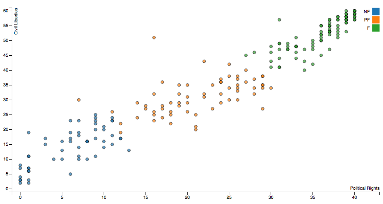

# The Limits of Liberalism

This is an argument about the compatibility, or rather _incompatibility_, of liberalism and democracy.  For much of it's modern history, democracy has been synonymous with _liberal democracy_, the system of government associated with the free and fair election of the legislative and executive branches, the rule of law, and constitutional checks and balances that limit the power of government and protect the individual freedoms and rights of the people.

Both liberalism and democracy share many fundamental values.  Autonomy and self-determination, individual in the case of liberalism and collective for democracy, lie at the heart of both doctrines. So too does the ideal of equality in the form of equal tolerance and protections for all in the case of the former, and equal representation and political rights in the latter.  Despite their common conflation however, liberalism and democracy are distinct but related concepts that attempt but ultimately fail to complement each other.

The essence of my argument can be laid out as follows:

  1. Democracy requires constraints to its powers
  2. Liberalism requires reconciliation of its contents
  3. Liberalism can't reconcile liberally or democratically
  5. Therefore the constraints necessary for liberal democracies can't be reconciled.

In part one of this paper, I will explore the nature of liberalism and democracy, their content and demands, and how they interact with one another.  While democracy is often conflated with liberalism, they are different conceptions of political power describing _who_ wields power and _what_ constraints are imposed upon that power.  As such, _illiberal democracy_ and _liberal non-democracy_ are just as coherent descriptions of political systems as the term liberal democracy is, with many historical and contemporary states accurately described as such.

In part two, I will argue that democracy requires requires constraints to its power, but these constraints need not be liberal, at least in the short term.  Yet democracy and liberalism share many fundamental values, not least the idea of self-determination so it seems highly unlikely that democracies constrained by illiberal means will remain stable over time.  Liberal constraints to democratic power are therefore complementary.

In part three, I will examine how liberalism begets pluralism.  Within any liberal regime, the very freedoms that liberalism allows will entail a number of competing yet reasonable conceptions of what liberalism requires, protects, and prohibits.  Liberalism requires certain rights to be protected.  Yet the protection of any right necessarily comes at the expense of some other. Liberalism therefore entails reasonable disagreement concerning its contents.  This disagreement must somehow be reconciled.

Finally in part four, I will demonstrate that attempts to reconcile liberalism both democratically and impositionally are self defeating. One way to reconcile the pluralism that liberalism entails is to do so democratically.  But democratic processes are collectively binding actions, and whenever we attempt to determine the which of freedoms and rights are immune from the scope of collectively binding action with collectively binding action, we render that immunity vacuous.  Thus it appears that liberalism's content cannot be reconciled liberally, exposing liberal democracies to serious risks of instability.

## Democracy & Liberalism

#### Same same 

I take it as uncontroversial the claim that the term _democracy_ has a broad and contested meaning [^gallie][^gallie1955]. In contemporary use, democracy may refer to idea, theory, or practice ranging from the direct participation of the people in a political process [^mutz2003], voting and the election of officials to hold public roles [^dahl2013], deliberation and the use of public reason [^cohen1989], to an epistemic tool that aggregates beliefs and enhances the truth content of them [^estlund2009]. Democracy need not limit its concerns to government and societal politics either - democracy can also be used to describe processes in the workplace [^greenberg1986], within the family [^pateman1970], and democracy itself [^keane2009].

[^gallie]: Democracy is the epitome of what WB Gallie describes as an _essentially contested concept_ - a term characterised by widespread agreement on its concept but staunch disagreement pertaining to specific realisations of that concept.  Elsewhere in my thesis, I justify a specific thin conception of democracy but for now, it will be sufficient to define democracy as any instance of political authority where power is equally wielded by a significant majority of those whom it is wielded over.

In contemporary usage, _Democracy_ has become synonymous with _liberal democracy_ and is often used to mean simply _liberalism_ [^conflation]. This is probably because for most of the last 200 years, every actual democracy was in fact a liberal democracy.  Whether in Western Europe, North America, or The Antipodes, democratic states were also liberal ones - key political rights and duties were made explicit in a constitution; and an independent judiciary provided an effective check and balance to the executive and legislative branches of government; and speech and religious beliefs were protected.  Liberalism is so intertwined with democracy in these cases that it seems hard to imagine one without the other.

[^conflation]: Corey Brettschneider for example contends that rights to privacy, property, and welfare are essential _democratic_ rights.  See Brettschneider, C. (2010). Democratic rights: The substance of self-government. Princeton University Press.

Conversely, the non-Western world was typically, although not exclusively, both undemocratic and illiberal.  While most European monarchs were forced to relinquish their absolute power and submit to some form of constitutional liberalism, those of Africa and Asia held near total power until only a few decades ago [note on Africa & Thailand].  Post war decolonisation saw a brief flirtation with democracy for many newly independent states but more often than not, power was snatched in coup d'etat and revolution, with decidedly illiberal and undemocratic results.

This correlation between civil liberties and fair electoral processes is remarkably high.  Analysis of the most recent Freedom House's _Freedom of the World_ survey data [^freedomhouse], demonstrates a very strong relationship between liberalism and democracy.  Charting civil liberties measured by freedom of expression and belief, associational and organisational rights, rule of law, and personal autonomy and individual rights; against political rights measured as electoral process, political pluralism and participation, and functioning of government for all 209 states and independent territories on the planet; and performing regression analysis shows an r value of 0.9578, a near perfect correlation.  

  
[Figure 1 - Freedom House 2014 survey data scatter plot](scatter-plot.html)

In addition to the strong empiric correlation, both liberalism and democracy also offer striking similarities in their conceptual appeal.  Democracy gives the people a high degree of self-determination, it makes them masters of their own political destiny more than any contemporary political system.  In short, democracy provide people with collective autonomy, the capacity to create their own laws and live by them.  Liberalism does the same for the individual in society.  Its requirements of tolerance, and the rule of law provide individuals with protection from the arbitrary decisions of others, allowing them to assert their own personal moral autonomy free the edicts of the state.

Democracy also requires a commitment to political equality.  Democracy is not simply the rule of some people, it is the rule of _the_ people, the rule of the many.  For a state to be considered fully democratic, equal suffrage must be extended to at least all adult citizens.  Restrictions on political participation based on gender, race, or caste are considered undemocratic.  Stratified suffrage by contrast, the unequal distribution of political rights across the demos, may still be considered the rule of the people, but results not in a democracy but in what Aristotle described as _timocracy_ [^timocracy][^citizens].

[^timocracy]: Timocracy originally described the rule of the honourable but became corrupted in Athens to system of political rights based on financial contribution.

[^citizens]: On this point, it is important to note that while equal suffrage may apply to all citizens, citizenship may be highly restricted and discriminatory.  In the Athenian Democracy, often lauded as an exemplar of direct democracy, only a minority of residents were citizens, resulting in suffrage being extended to less than 15% of the population.

Liberalism too involves a strong commitment to equality.  While a 'liberal', as Maurice Cranston noted, is anyone who believes in liberty, liberalism requires reciprocity of liberty.  Even the autocrat values his own liberty, so what sets liberalism apart from an egoist conception of liberty is its requirement that one's own liberty be compatible with that of everyone else - of equal liberty.  As Herbert Spencer put it: [^spencer1868]

> Each has freedom to do all that he wills provided that he infringes not the equal freedom of any other.  
> -- Herbert Spencer, Social Statics, c. 4, § 3.

#### But different

Democracy and liberalism are however, clearly different beasts, describing different aspects of freedom and political power, as well as having differing and sometimes conflicting requirements.  Even cursory reflection should demonstrate the conflation of the two to be unhelpful.  

Etymology of the terms is illustrative, _Δημοκρατία_ or _dēmokratia_ means nothing more than the power or rule (_kratos_) of the common people (_demos_).  It was distinguished from other forms of rule by Aristotle such as _monarchy_, the rule of one, _oligarchy_, the rule of many, _aristocracy_, the rule of the best, and _timocracy_, the rule of the honourable.  Democracy is a description of _who_ wields power in a society, of who reigns and who is sovereign.

Liberalism by contrast, is the doctrine of liberty.  In latin, _liber_, a nobleman or freeman, is the antonym of _servus_ or a slave.  To be liberal is to be free.  During the enlightenment, a _liberal_ meant one who was tolerant, and free from prejudice.  Liberalism as a political ideology is one that promotes the primacy of individual liberty as a normative primitive, by recognising what Jerry Gaus calls the _fundamental liberal assumption_ in favour of freedom [^gaus1996].  Liberalism is a description of _what_ power can be wielded in a society, of what is subject to the claims of a sovereign and what freedoms are protected from her.

The very fact that we can conjoin the terms _liberal_ and _democracy_ implies the possibility of their conjunctive negations - illiberal democracy, liberal non-democracy, and illiberal non-democracy.  Fareed Zakaria, for example, has argued that the collapse of communism and subsequent transition to popular rule has heralded the rise of the illiberal democracy - a state characterised by electoral politics that "are rarely as free and fair as in the West today, but they do reflect the reality of popular participation in politics and support for those elected" [^zakaria1997:p23], but one lacking the constraints and protections for individual freedoms normally found in liberal regimes. Democracy is flourishing, he argues, but liberalism is not.

Democracy and liberalism can therefore be conceptualised to represent two different axes related _who_ wields power within a political system and _how_ it is wielded, ie directly or via representatives; and _what_ limits that power is subject to.  So we can construct a two dimensional topography of four quadrants: [^møller]

        Liberal non-Democracy     |     Liberal Democracy
          -----------------               -------------
        Illiberal non-Democracy   |     Illiberal Democracy
    

[^møller]: Jørgen Møller provides a similar topology of democracy and autocracy based on electoral and liberal components.  See A Critical Note on ‘The Rise of Illiberal Democracy', _Australian Journal of Political Science_, Vol. 43, No. 3, 2008, p. 555-561.

The term _illiberal democracy_ can cover a diverse range of political systems characterised by popular political participation but with significant constraints placed upon individual behaviours and personal freedoms: constitutional monarchies like Bhutan [^bhutan] and democratic theocracies such as Iran.  Illiberal democracy can also include what might be called _democratic totalitarianism_, a system of absolute majoritarianism where the demos wields complete control over all aspects society and all actions are regulated by collective decision.

[^bhutan]: Despite holding free and fair competitive elections, Bhutan has also ordered the mass expulsion of ethinic minorities and only permitted television and public internet usage since 1999.

_Liberal non-democracies_ are regimes that provide strong protections for individual freedoms but offer little or no popular participation in politics, for example a liberal colony, monarchy, autocracy, or kritocracy.  Examples of liberal non-democracies would include Victorian England, where even by 1810, suffrage had only been extended to just 10%, Austro-Hungarian empire, or both British and Chinese ruled Hong Kong.

So despite common conflations, it is clear that democracy and liberalism are related but different conception, ones concerned with who exercises power in the case of democracy, and how that power is constrained in the case of liberalism.  And while liberalism and democracy obviously complement each other and are often found together, they need not be as demonstrated in a number of historical and contemporary cases.

## Democracy & Stability

By themselves however, democracy and liberalism are incomplete concepts, unable to stand alone or without assistance.  The instability of _naked democracy_ or unchecked majoritarianism, as well that of liberalism, has a well documented history.

> Tyranny naturally arises out of democracy, and the most aggravated form of tyranny and slavery out of the most extreme form of liberty.  
> -- Plato, The Republic, Book 9

As political theorists from Aristotle to Acton have observed, absolute power corrupts absolutely.  Democracy requires some form of constraint, either procedural or substantive, on it's power in order to survive and remain democratic. Absent constitutional limits or strong political norms, naked democracy tends to degenerate into dictatorship and tyranny.  

> For in democracies which are subject to the law the best citizens hold the first place, and there are no demagogues; but where the laws are not supreme, there demagogues spring up.  
> -- Aristotle, Politics, Book 4

In electoral democracies, representatives unrestrained by the rule of law have a strong individual incentive to repeal constitutional constraints and undermine limits to their power.  History is littered with the debris of once democratic states, whose popularly elected leaders transformed into tyrants once they were elected to power - Mussolini's Italy, Hilter's Germany, Mugabe's Zimbabwe, and Lukashenko's Belarus serving as just a few examples. 

One obvious constraint to democratic power then, is liberalism.  Since the signing of the Magna Carte, liberal principles have been used to limit the power of the sovereign, both monarch and democrat.  Due process and equality before the law, a prohibition on cruel and unusual punishment, religious autonomy, and property rights for freemen were some of the provisions that helped secure greater liberty and autonomy for citizens, and limited encroachment by the sovereign into personal lives. The Bill of Rights (1689) and the Act of Settlement further enhanced parliamentary sovereignty and judicial independence.  

In the late 18th century, Maddison famously argued for the necessity of liberal constraints to prevent the worst democratic tendencies: [^hamilton2005] 

> Hence it is that such [naked] democracies have ever been spectacles of turbulence and contention; have ever been found incompatible with personal security or the rights of property; and have in general been as short in their lives as they have been violent in their deaths.  
> -- James Maddison, Federalist #10

Liberalism, sharing many virtues with democracy, offers democracy a complementary constraint to its potential vices.  In states transitioning from autocracy or totalitarianism to democracy, a lack of liberal tradition is an oft cited concern for their political stability.  Today, many are concerned about popular support for openly racist, fascist, or fundamentalist parties, whether it is the Muslim Brotherhood in Egypt, the AKP in Turkey, or the multitude of 'Peoples' or 'Freedom' parties in Europe.  Illiberal yet popular policies pose a significant challenge for any liberal democracy.

But while liberalism can act as a constraint to democratic power, it is not however, a necessary constraint.  Democratic power can be constrained by a number of means, for example by a constitution, by convention, or even contingently.  And these limits, underpinned by the rule of law, need not be liberal.  

No single flavour of liberalism, what Rawls calls a _comprehensive liberal doctrine_, exists.  What is liberal in one society differs from what is liberal in another.  The United States has strong formal protections for speech and religious belief, and requires a strict separation of religious from government activities.  In Norway and many other European liberal democracies however, an official religion is recognised in the constitution, the state controls and collects tax on behalf of the state church; in Denmark, the _Minister for Ecclesiastical Affairs_ is a cabinet position.  Hate-speech and anti-vilification laws place limits on the freedom of speech in many other liberal countries, while the German Constitutional Court has banned certain political parties like Communist, Nazi, and Socialist Reich parties.

Illiberal constitutions, such as those of democratic theocracies, can (at least theoretically) be an equally effective limit to democratic power.  In the Constitution of the Islamic Republic of Iran, sovereignty is derived not from the people but from God, and political office is limited to only those suitably qualified in the teachings of the _Qur'an_ and _Sunnah_.  Yet the constitution also mandates popular elections for the presidency and parliament, a separation of powers between judiciary, legislature, executive, the religious Guardian Council, as well as a number of positive liberties such as universal health care and social security.  While Iran is clearly not as democratic as any liberal democracies, its illiberal constitution provides clear limits to popular political power. 

Neither do constraints to democratic power need to be listed in a formal constitution either.  Conventions can also serve as an effective limit to democratic power.  The UK, like many states, has no single constitutional document.  Rather, constraints on the sovereign and parliament, and protections of individual rights, are an amalgamation of statutes, judicial precedence, treaties with foreign states, as well as many uncodified and informal procedures.  Similarly, the Australia constitution makes no mention of the office of Prime Minister despite it's dominant role as the apex of executive government in the country.

Strong societal and moral norms are another possible constraint. Provided that a sufficiently broad consensus concerning permissible acts of government or individuals exist amongst political elites and the demos, certain actions will effectively remain off limits to democratic rule.  This may also happen contingently, when for example, personal freedoms exists simply because no law prohibiting them has yet been passed.  However while democratic limits imposed by convention or contingently may work, and often over long periods of time, the less explicit a constraint is, the less likely it will be effective.  

It is clear then, that while democratic constraints - liberal or illiberal, constitutional, contingent, or by convention, can have significant variation between states and polities, there are also a number of similarities.  Some - like the rule of law, constitutional checks and balances, judicial independence, and the separation of powers across different branches of government - while often associated with the liberal tradition, are neither liberal nor illiberal.  They are found in both cases and are necessary for democratic stability in the short term.  These constraints, directed towards limiting the concentration of power and degeneration of democracy into tyranny, can be classified as _electoral_ or _procedural_ constraints [^electoral].

[^electoral]: I use the term _electoral_ here broadly, noting that these same constraints can also apply to direct democracies.

Other constraints, those that protect specific behaviours and rights of individuals, such as those found in Bills and Declarations of Rights, can be classified as _liberal_ or _substantive_ constraints. These limits are not present in illiberal regimes as they encompass what are substantive liberal values, despite their varied content across liberal democracies.  All democracies require electoral constraints to ensure they don't degenerate into tyranny.  And while many democracies are also constrained by liberal principles, the existence of illiberal democracies demonstrates that liberal constraints are not necessary for democratic stability, at least in the short term.

But what of long term stability?  Noting the strong alignment of liberal and democratic values like autonomy, equality, and self-determination, it seems unlikely that citizens with the means to realise their collective destinies in illiberal democracies would not desire and seek similar levels of self-determination and autonomy in their private lives.  Constraints on belief, expression, and action, whether imposed by an autocrat or a majority, will become a source of conflict for individuals and minorities denied their autonomy.  Unlike their illiberal counter-types, liberal democracies, can avoid such friction points within society by promoting tolerance and ensuring that beliefs and behaviours that don't impinge upon others are protected from the state's legislative authority, thereby allowing disparate and irreconcilable beliefs to peacefully coexist.

Illiberal democracies however, must ensure that the political friction emerging from this dissatisfaction is extinguished before it disrupts the political system.  Indoctrination of the demos in the virtues of a regime's illiberal doctrine is one way this might be achieved.  By prioritising the illiberal over the democratic, disputes over democratic and illiberal values can be resolved in favour of the latter.  If this fails however, illiberal democratic regimes must resort to the use of force against dissenters to ensure democratic stability, something Rawls christened 'the fact of oppression' [^rawls2005:p37]

If like many however, we accept that the state's use of coercive oppression to promote a particular conception of the good is unjustified, then we must conclude that a stable democracy requires liberal constraints - and I will simply assert without further argument that this coercion is unjustifiable.  This does not however, undermine the conclusion that illiberal constraints are also sufficient for democratic stability in the long run, provided we can overcome the moral objection to oppression.

## Liberalism & Pluralism

Just as democracy cannot stand alone as a concept or practice, neither can liberalism.  Like democracy, liberalism is also an essentially contested concept with a multitude of interpretations, many of which conflict and are irreconcilable with each other.  These differences are partly a result of what we mean by freedom, but also how we believe equality affects that freedom.  We therefore need to predicate the term _liberalism_ with a qualifying adjective - social, classical, welfare state, or republican, in order to adequately clarify our intentions.  

All conceptions of liberalism however require the protection of certain beliefs, expressions, and actions from the interference of the state and other citizens.  These protections typically take the form of political and legal rights for individuals and corresponding duties on the state.  Liberalism determines and partitions private rights from public politics, constraining the power of the state to pass laws governing what has been deemed private affairs.  Examples of liberal constraints on democracy are well know: the US Bill of Rights and the French Declaration of the Rights of Man and of the Citizen for example, protect speech, religious belief, due process, and many other values fundamental to human freedom.

Protecting and promoting any right however, necessarily comes at the expense of others.  As WN Hohfeld observed, rights are the correlatives of duties [^hohfeld1913].  Any right I may have to _X_ means that others have a duty not to prevent me _X_-ing.  The correlative identity of rights and duties means that general rights to _X_ and not _X_ cannot simultaneously exist if the correlative duties are imposed on the same subjects (typically the state).  As an example, a constitutional constraint that protects a citizens right to carry semi-automatic firearms in public necessarily prevents the existence of right for citizens not to be injured or killed in a mass-shootings; and rights to free speech necessarily conflict with rights not to be defamed and offended by others; 

The realisation of any liberal conception as a constraint on democracy, must therefore result in the prioritisation of certain protections over others.  We must order our individual rights and determine which are to take priority over others; and specify the balance between free speech and defamation, the bearing of arms and physical safety.  These orderings can be viewed as a set of liberal values - some sets will be more compatible with others.  Some may even represent the optimal set of individual rights compatible with all others.  

> Your right to swing your arms ends just where the other man's nose begins.   
> -- Zechariah Chafee, Jr.

A great deal of liberal discourse is concerned with exactly this task.  JS Mill for example, provided a classification of justifiable constraints upon personal freedoms that he felt would result in a clearly superior degree of liberty for all. 

> That the only purpose for which power can be rightfully exercised over any member of a civilized community, against his will, is to prevent harm to others.  
> -- JS Mill, On Liberty, I §9

Mere offence, moralism, or paternalism were insufficient grounds to restrict individual behaviour. Self-regarding actions like the expression of religious belief ought be immune from collective regulation without the consent of the subject.  The regulation of actions that resulted in genuine harm to others however, was fully justified.

Yet the long running debates concerning the content of liberal protections, of the demarcation between self and other regarding actions, of genuine harm and mere offence, indicate that identifying an objectively best set of individual rights may never occur.  As many theorists have recognised, liberalism engenders a plurality of conceptions of the good, of religious and philosophical world views - what Rawls calls _comprehensive doctrines_. According to Rawls [^rawls2005:p55], these differences are a result of the burdens of our judgement.  He argues that free institutions, the manifestation of constitutional liberalism, result in a reasonable pluralism of belief concerning the good and how best to realise it.  

Different kinds of normative assessments, complex and conflicting empiric evidence, and judgements of relevance that freedom of religion, thought, and speech promote, all contribute to and entail different reasonable yet irreconcilable comprehensive doctrines. This fact of reasonable pluralism is, Rawls claims, "the long run outcome of human reason under free institutions" [^p4], a "permanent feature of democratic public culture" [^p36] and not some "unfortunate condition of human life" [^p37].  And this applies not just to comprehensive doctrines, but also various reasonable liberal political conceptions, concerning which individual rights and duties should be protected and prioritised.

[^p4]: _ibid_ p4

[^p36]: _ibid_ p36

[^p37]: _ibid_ 37

Even if an objectively optimal set of liberal protections did exist, and the naturally occurring differences in normative assessments between reasonable members of society could be eliminated, there are still no guarantees that this set would be unique.  If a single objectively optimal set of rights can exist, there is nothing to indicate that others wouldn't also exist, meaning that the even if we could reconcile our judgements of moral facts , the debate could never be settled.  Thus, the contested contents of liberalism, of which rights and freedoms should be promoted and protected at the expense of other rights and freedoms, must somehow be reconciled.

## Reconciling Liberalism

A number of competing strategies to reconcile liberalism exist, but they can all be capture in the conjunctional description of either impositional or non-impositional.  Impositional strategies are those that seek to impose their solutions upon citizens despite any disagreement subjects may have.  Non-impositional strategies by contrast require that citizens willingly accept the solution to the challenge of reconciling liberalism.

Reconciling disagreement concerning the contents of liberalism by imposition is a decidedly illiberal solution.  One of the fundamental substantive values of liberalism is tolerance - for other's beliefs, values, and actions.   Yet seeking to impose a particular liberal conception onto those who disagree, along with the accompanying oppressive force needed to support that imposition, brings the solution into sharp conflict with the liberal value of tolerance.

Obviously liberalism doesn't require tolerance of all views and actions.  To accept and permit any action, including those incompatible with itself, would render any doctrine incoherent.  Liberalism is right to reject and prohibit the unreasonable demands.  Liberalism may certainly permit the existence of fundamentalist, intolerant, or otherwise illiberal beliefs, and allow those who hold them to publicly assert their views and press their claims, but it does not require others seriously consider them.

But unreasonable disagreement is not the concern here.  The disagreement concerning the contents of liberalism that needs to be reconciled is reasonable disagreement over competing, irreconcilable conceptions of what liberalism requires.  How ought liberal societies balance the right to liberty with basic liberties, how should we prioritise individual freedoms when this will likely result in a failure of collective endeavour?[^collective]  It is to these reasonable views [^reasonable] that liberalism is unable to impose upon without undermining its own coherence.

[^collective]: I have in mind here problems of free riding where impositional assurance is needed to ensure the creation of a significant public good necessary for the realisation of substantive ends.
 
[^reasonable]: Reasonable here needs to be distinguished from rational or even the use of 'reason'.  My use of the term correspond's largely with Rawls' use - "persons are reasonable in one basic aspect when, among equals say, they are ready to propose principles and standards as fair terms of cooperation and to abide by them willingly, given the assurance that others will do likewise" _Political Liberalism_, p49

For liberal democracies, the obvious strategy for reconciliation is to do so democratically.  When disagreement over the required content of liberalism exists, we could simply deliberate, debate, and vote on what individual rights and freedoms should be protected.  And many procedures of liberal democratic institutions allow for exactly this.  The constitutions of most democratic states, simultaneously provide the legal foundations for liberal protections while providing the means for their alteration through referenda, plebiscite, or ratification - the most famous example being the first 10 amendments to the US constitution which collectively form the Bill of Rights.

Yet attempting to reconcile liberalism's content democratically renders the constraints liberalism imposes on democracy vacuous.  Democratic processes are collectively binding actions.  Whether it is the majority vote of a direct democracy, a constitutional referenda, or an act of parliament, democratic processes are collective processes of the demos or their delegates. And while not every citizen may have voting in that process or the election of representative subsequently were, those who didn't where offered the opportunity to and chose not to participate.  Likewise, the results of any democratic process are binding - if the authority of a process is legitimate, then we have moral obligations to obey the outcome of that process.

Yet liberalism requires the partitioning of private rights from public action.  In order to constrain democracy, it requires that certain beliefs, actions, and expressions be immune from democratic power.  So if we attempt to identify which elements of our lives are to be immune from the scope of collectively bind action with collectively binding action, our attempts become self defeating.  By voting on what issues can't be voted on, we simply demonstrate that those issues can be in fact be voted on.

All liberal constitutional constraints are subject to this problem.  If we accept a constitution as fixed and thus immune of democratic amendment, then we fail to reconcile the inevitable disagreement concerning the contents of the constitution.  If however, we accept that the constitution is open to democratic revision, even by super-majority or a majority of states, then the revision is still democratic and self defeating.

Other approaches to the problem of liberalism's reconciliation remain however, and Rawls offers us one in the form of public reason.  By starting with a conception of society as a mechanism of fair cooperation between free and equal persons, practical reason allows us to determine what basic and fundamental values of society require protection to ensure stability of liberal democracies over time.  Through the use of public reason, the hope is to find an overlapping consensus on the content of liberalism the is compatible with, or at least does not conflict with, individual's reasonable comprehensive conceptions.  The result, famously, is a freestanding conception of justice, a political liberalism.

Public reasons - the giving reasons that other reasonable people might reasonably accept - help us find common ground.  Through the requirements of public discourse and the disinfectant of public scrutiny, public reason enhances the epistemic quality of our beliefs.  Through the requirement of seeing other's perspectives, it widens the scope of our agreement.  In short, public reason broadens collective consensus, increasing the overlap of individual beliefs.  And if this overlapping consensus concerning the content of liberalism is unanimous, then we will have succeeded in finding a solution to the problem of reconciliation that is neither impositional because we all agree; nor collectively binding because it is individual choice rather than coercion that enables cooperation.

But Rawls was adamant that this overlapping consensus would never be unanimous.  It was designed simply to generate a sufficiently broad consensus to ensure democratic stability, with disagreement still reconciled by voting or some other democratic process.  This reliance on democratic processes to reconcile liberalism's content however, leaves public reason liberalism in the same dilemma.

## Conclusion

In this paper, I have attempted to examine the complementary and conflicting nature of liberalism and democracy, and how the limits of liberalism threaten democracy's practical stability and theoretical coherence.  Democracy has often been conflated with liberalism, when in fact they are different conceptions of political power describing _who_ wields power and _what_ constraints are imposed upon that power.  _Liberal democracy_, _illiberal democracy_ and _liberal non-democracy_ are equally coherent descriptions of political systems.

Naked, unchecked democracy quickly descends into tyranny.  Democracy requires requires constraints to its power, but these constraints need not be liberal, at least if we can accept the coercive use of force to promote a particular conception of the good.  Democracy and liberalism however, share many fundamental values, not least the idea of self-determination so it seems highly unlikely that democracies constrained by illiberal means will remain stable over time.  Liberal constraints to democratic power are complementary, and necessary if we reject coercion to promote a particular conception of the good.

The nature of liberalism however is to promote pluralism.  Within any liberal regime, the very freedoms that liberalism allows will entail a number of competing yet reasonable conceptions of what liberalism requires, protects, and prohibits.  These rights need to be protected, and their correlative duties need to be enforced.  But the protection of any right necessarily comes at the expense of some other.  Liberalism therefore entails reasonable disagreement concerning its contents and this disagreement must somehow be reconciled.

Attempting to reconcile the disagreement pertaining to liberalism's content however, is self-defeating.  One obviously way to reconcile the pluralism that liberalism entails is democratically.  But democratic processes are collectively binding actions, and whenever we attempt to determine the which of freedoms and rights are immune from the scope of collectively binding action with collectively binding action, we render that immunity vacuous.  Neither can we reconcile the contents of liberalism by imposition without undermining a key substantive requirement of liberalism - that of tolerance.

Public reason liberalism offers a promising account of how a solution to the problem of reconciliation may be found.  Through public discourse and the giving reasons that other reasonable people might reasonably accept, a free standing liberal conception based on an overlapping consensus might be found.  Yet the reasonable pluralism that liberalism begets, and the different normative assessments that are a nature part of liberal democratic life, will ensure disagreement will remains.  And short of unanimous agreement, it appears that liberalism will remain internally inconsistent.  When democratic stability relies on liberalism and its constraints to democratic power, the inability of liberalism to reconcile internal conflict becomes a significant problem for democracy.

[^cohen1989]: Cohen, J. (1989). Deliberation and democratic legitimacy. Debates in Contemporary Political Philosophy, 342.

[^dahl2013]: Dahl, R. A. (2013). A preface to democratic theory. University of Chicago Press.

[^estlund2009]: Estlund, D. M. (2009). Democratic authority: a philosophical framework. Princeton University Press.

[^freedomhouse]: http://www.freedomhouse.org/report-types/freedom-world accessed on 10 May 2014

[^gallie1955]: Gallie, W. B. (1955, January). Essentially contested concepts. In Proceedings of the Aristotelian society (pp. 167-198). Harrison & Sons, Ltd.

[^gaus1996]: Gaus, G. F. (1996). Justificatory liberalism: An essay on epistemology and political theory.

[^greenberg1986]: Greenberg, E. S. (1986). Workplace democracy: The political effects of participation. Ithaca: Cornell University Press.

[^hohfeld1913]: Hohfeld, W. N. (1913). Some fundamental legal conceptions as applied in judicial reasoning. Yale Law Journal, 16-59.

[^keane2009]: Keane, J. (2009). The life and death of democracy. Simon and Schuster.

[^hamilton2005]: Hamilton, A., Madison, J., Jay, J., & Pole, J. R. (2005). The federalist (Vol. 43). Hackett Publishing.

[^mutz2003]: Mutz, D. C. (2006). Hearing the other side: Deliberative versus participatory democracy. Cambridge University Press.

[^pateman1970]: Pateman, C. (1970). Participation and democratic theory. Cambridge University Press.

[^rawls2005:p37]: Rawls, J. (2005). Political Liberalism. Columbia University Press. p37

[^rawls2005:p55]: Rawls, J. (2005). Political Liberalism. Columbia University Press. p55

[^spencer1868]: Spencer, H. (1868). Social statics.

[^zakaria1997:p23]: Zakaria, F. (1997). The rise of illiberal democracy. Foreign affairs, 22-43. p23
